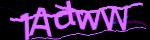
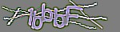
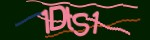

CAPTCHA Recognition 🔐🤖

A Deep Learning Approach using CRNN + CTC Loss

   

📌 Overview

This project implements a deep learning pipeline to recognize text-based CAPTCHAs using a Convolutional Recurrent Neural Network (CRNN) combined with Connectionist Temporal Classification (CTC) loss.

Character set: Uppercase A–Z, Lowercase a–z, Digits 0–9 (62 symbols).

Input size: Images are resized to 200×50, converted to grayscale, enhanced with CLAHE, and normalized.

Output: Sequence of 5 predicted characters decoded with CTC.

📂 Repository Structure

- model.py         # CRNN model (inference + training with CTC)

- preprocess.py    # Dataset loader & preprocessing

- train.py         # Training & evaluation script

- test.py          # Inference (single image / folder)

- requirements.txt # Dependencies

- README.md        # Documentation

- saved_model/     # Saved checkpoints (.keras)

📊 Dataset

Source: Kaggle — Captcha Dataset (123k images)

- Filenames encode ground truth labels (e.g., aB3xQ.png → "aB3xQ").

- Fixed length: 5 characters (MAX_CHARS=5 in preprocess.py).

Update dataset path in preprocess.py: DATA_DIR = "/path/to/dataset"

🏋️ Training (python train.py)

- Preprocess dataset → Train/Test split.

- Train CRNN with CTC loss (30 epochs).

- Save checkpoints → saved_model/crnn_ctc_best.keras.

- Export final model → saved_model/crnn_ctc_final.keras.

📈 Evaluation

Metrics:

- Exact Match Accuracy (all 5 chars correct).

- Character Error Rate (CER).

Results (Kaggle dataset, 62-class setup):

🎯 Exact Match Accuracy: 0.8066

✂️ CER: 0.0769

🔍 Inference

- Single image:
  
		python test.py --model saved_model/crnn_ctc_final.keras --image path/to/captcha.jpg

- Folder of images:

		python test.py --model saved_model/crnn_ctc_final.keras --folder path/to/images --limit 50

-- Extra flags:

--no_auto_crop → disable smart cropping

--force_invert → force color inversion

--strong → stronger preprocessing for thin strokes

--save_debug out/ → save debug images

🖼️ Examples

    

⚙️ Notes

- To use lowercase + digits only, update CHARS in preprocess.py and adjust NUM_CLASSES in model.py.

- Ensure CNN time steps ≥ label length (automatically checked in train.py).

👨‍💻 Author

💼 [https://github.com/msaad-dot]
